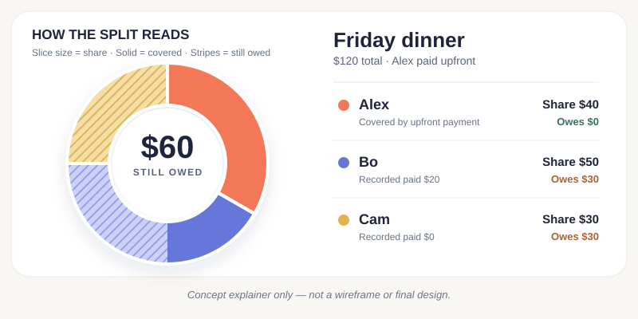

# Bill split: What it is

## The idea

A bill-splitting app centered on a large, interactive pie chart. The person who paid enters everyone's share, tracks reimbursements, and exports the chart as an image to request payment. The image stands on its own: each person can see their share, what is covered, and what they still owe.

## Problem and opportunity

Bill totals, uneven shares, and partial payments get lost in group chats. A beautiful, clear image may be easier to share with friends; seeing the same status as the group may create social pressure to settle up and reduce individual follow-ups. We need to test whether recipients find that helpful or uncomfortable.

[Splitwise](https://www.splitwise.com/) and [tricount](https://www.tricount.com/) track shared balances. This concept focuses on a **single-bill request that works as an image**, even if recipients never use the app.

## Audience and scope

For a friend who paid upfront for dinner, tickets, or another group expense. The first version handles **one bill, one payer, one currency, and 2–8 people**. Reimbursements happen outside the app and are marked manually.

## User journey

1. Enter the bill total and people; split equally or set custom shares.
2. Review the chart and exact amounts.
3. Export the image and share it in the group chat.
4. Mark reimbursements as received; export a new image when the status changes.

## The chart

| Visual | Meaning |
| --- | --- |
| Slice size | Person's share of the bill |
| Solid / striped area | Covered / still owed |
| Center | Total still owed |
| Labels | Each person's exact share, covered amount, and amount owed |

In the example above, Alex paid **$120** upfront. Alex's **$40** share is covered by that payment; Bo has reimbursed **$20** of **$50**; Cam still owes **$30**. The group owes Alex **$60** in total.

### In the app

Tap, hover, or focus a slice to inspect a person. Editing shares or recording a reimbursement updates the chart immediately. A text list shows the same amounts.

### As an image

The export includes the bill title, total, payer, per-person amounts, total owed, and an “as of” timestamp. It remains readable in a phone preview, without interaction or a link. An old export stays a dated snapshot; changes require a new image. Text and patterns carry meaning alongside color, following [W3C guidance](https://www.w3.org/WAI/tips/designing/).

## Visual direction

Aim for a polished, poster-like chart with generous space, confident type, distinct colors and patterns, and restrained live motion. Keep branding small so the payment request stays clear. The image above is an **understanding aid, not a wireframe or final design**.
